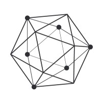
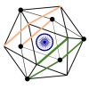

### Say Hi to Arun!

<table style="table-layout: fixed; border-collapse: collapse; margin: 50px 10px; font-size: 2em; font-family: sans-serif; min-width: 400px; box-shadow: 0 0 60px rgba(0, 0, 0, 0.15); border-radius: 10px;">
    <thead style="background-color: #f3f3f3; text-align: center;">
        <th style="padding: 12px 15px; border-width: 20px; border-color: #dddddd; border-radius: 30px;" colspan="2">
            
            
            

                Leadership Experience
            

        </th>
        <th style="padding: 12px 15px; border-width: 20px; border-color: #dddddd; border-radius: 30px;" colspan="2">
            
            
            

                Speaker Engagements
            

        </th>
        <th style="padding: 12px 15px; border-width: 20px; border-color: #dddddd; border-radius: 30px;" colspan="2">
            
            

                Project Maintainer
            

        </th>
        <th style="padding: 12px 15px; border-width: 20px; border-color: #dddddd; border-radius: 30px;" colspan="2">
            
            
            

                Blogs
            

        </th>
        <th style="padding: 12px 15px; border-width: 20px; border-color: #dddddd; border-radius: 30px;" colspan="2">
            
            

                Open-Source Engagement
            

        </th>
        <th style="padding: 12px 15px; border-width: 20px; border-color: #dddddd; border-radius: 30px;" colspan="2">
            
            
            

                Work Experience
            

        </th>
    </thead>
    <tbody style="background-color: #dddddd;">
        <tr style="padding: 12px 15px; border-width: 20px; border-color: #dddddd; border-radius: 30px;">
            <td>
                

                    
                

            </td>
            <td>
                

                    Hyperledger Technical Steering Committee member
                

            </td>
            <td>
                

                    
                

            </td>
            <td>
                

                    BlockHash Live 2020
                

            </td>
            <td>
                

                    
                

            </td>
            <td>
                

                    Hyperledger Sawtooth
                

            </td>
            <td>
                

                    
                

            </td>
            <td>
                

                    Hyperledger Blogs
                

            </td>
            <td>
                

                    
                

            </td>
            <td>
                

                    Hyperledger Foundation
                

            </td>
            <td>
                

                    
                

            </td>
            <td>
                

                    Walmart, India
                

            </td>
        </tr>
        <tr style="padding: 12px 15px; border-width: 20px; border-color: #dddddd; border-radius: 30px;">
            <td>
                

                    
                

            </td>
            <td>
                

                    Co-lead, Hyperledger India Chapter
                

            </td>
            <td>
                

                    
                

            </td>
            <td>
                

                    BlockHash Live 2020
                

            </td>
            <td>
                

                    
                

            </td>
            <td>
                

                    Hyperledger Bevel
                

            </td>
            <td>
                

                    
                

            </td>
            <td>
                

                    Medium
                

            </td>
            <td>
                

                    
                

            </td>
            <td>
                

                    Enterprise Neurosystem
                

            </td>
            <td>
                

                    
                

            </td>
            <td>
                

                    Intel, India
                

            </td>
        </tr>
        <tr>
            <td colspan="2"></td>
            <td>
                

                    
                

            </td>
            <td>
                

                    Hyperledger Global Forum 2020, Phoenix & Hyperledger Sweden Meetup - 2020
                

            </td>
            <td colspan="2"></td>
            <td colspan="2"></td>
            <td colspan="2"></td>
            <td>
                

                    
                

            </td>
            <td>
                

                    MediaTek, Taiwan (ROC) & India
                

            </td>
        </tr>
        <tr>
            <td colspan="2"></td>
            <td>
                

                    
                

            </td>
            <td>
                

                    Hyperledger India Chapter - 2nd National Meetup 2019
                

            </td>
            <td colspan="2"></td>
            <td colspan="2"></td>
            <td colspan="2"></td>
            <td>
                

                    
                

            </td>
            <td>
                

                    National Instruments (NI), India
                

            </td>
        </tr>
        <tr>
            <td colspan="2"></td>
            <td colspan="2">
                

                    <a href="https://www.youtube.com/watch?v=DNvH1L288to&list=PLcoI6pNvrJ0SbhyYDvDywB_oOYmH1a-N9">More Videos</a>
                

            </td>
            <td colspan="2"></td>
            <td colspan="2"></td>
            <td colspan="2"></td>
            <td colspan="2"></td>
        </tr>
    </tbody>
</table>

### Connect with Arun:

